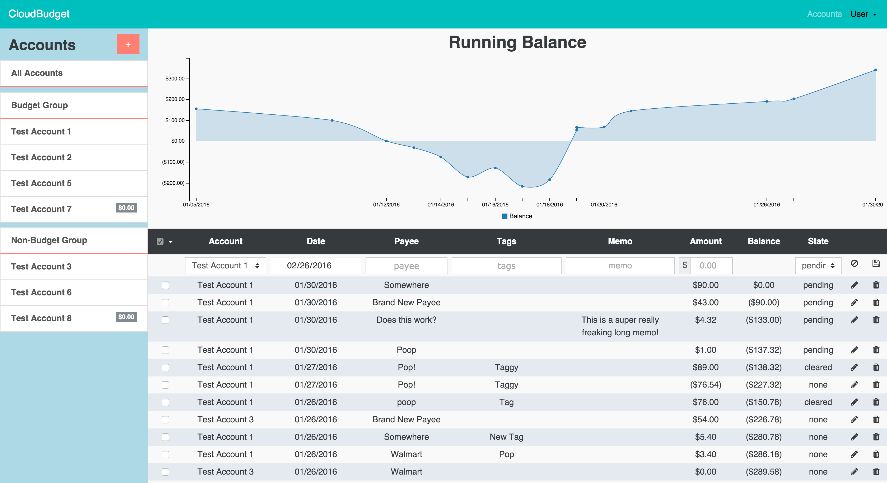

# CloudBudget

This is a revamp of [Cloudbudget-Legacy](https://github.com/mattjdev/cloudbudget-legacy).
I restarted with a different approach, and to be able to use ES2015 and a different frontend framework, currently VueJS.
Similar concepts apply, but I started with focus on being able to manage users, accounts and transactions first and foremost.
I already need to go back to the drawing board to create a better user experience, but that is the nature of this project, always learning and reiterating.

## Notes: 

### Develop:
* Dependencies

 * NodeJS
 * npm
 * bower
 * mongo

* Setup

I still need to work on making this easier to setup for people who wanted to tinker with it, but the following screenshot is the current UI. You can create an account, and transaction, and the graph helps you visualize the change in balance over time:

### Deploy:

* Checkout `master` and make sure `develop` is merged into `master`.
* `npm version [major|minor|patch]`
* Checkout `develop` and merge `master` into `develop`.
* On production machine (as www-data):
  * `git pull`
  * `git checkout tags/v[version]`
  * `npm install`
  * `npm start`
